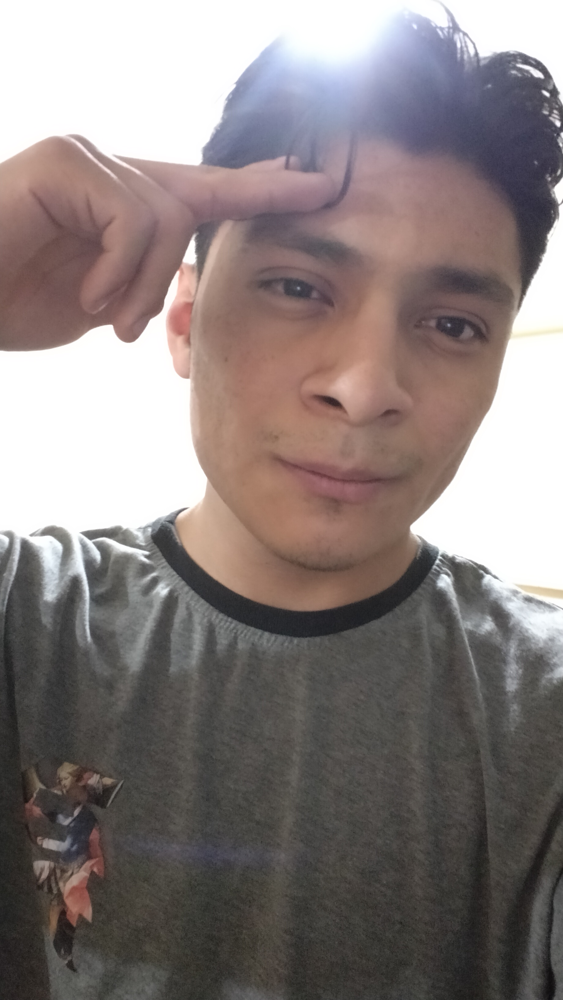

# Integrantes del grupo _@1Cyber_ de _Amerike_

## Estudiantes

### Arturo Galeana

- [agaleanacastillo@gmail](agaleanacastillo@gmail.com)
- [Tu perfil de _GitHub_](https://github.com/Arturodeamerike)

---

### Carlos Alexis Rendon Sierra

Tengo 20 años, me gustan los videojuegos , estudio la carrera de ciberseguridad en amerike y tengo un perrro llamado browny. 

- [cdmx2919@amerike.edu.mx](cdmx2919@amerike.edu.mx)
- [https://github.com/SpectralComet73](https://github.com/SpectralComet73)

 

---

### Sebastián Padilla Pardo

Hola, soy un alumno de primer año de la Universidad de _Ameriké_, tengo 21 años y veo ánime, así como otras cosas.

- [zap1154@amerike.edu.mx](zap1154@amerike.edu.mx)
- [Mi perfil de _GitHub_](https://github.com/SebastianP29)

---

#### Montserrat Hernández
# Practica 9
### Montserrat Hernández
Hola, en esta clase veremos cómo colaborar con otros compañeros y forckear

- [Email] (cdmx2968@amerike.edu.mx)
- [Perfil de _GitHub_] (https://github.com/Mont-xe)
- [Foto](https://drive.google.com/file/d/1Bbnq-BteqXfbDHQeF5aDGg2RA5NS68b2/view?usp=sharing)
  
